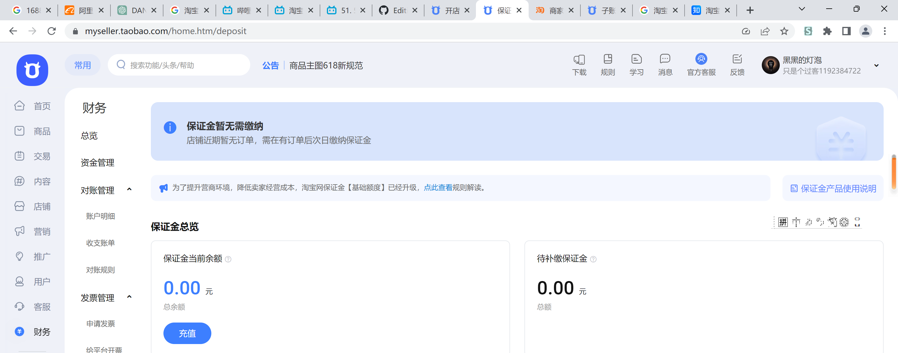

# 关于淘宝开店的一些知识储备和坑点😎

## 了解千牛🔥

你好，这是Bing。很高兴为你服务。😊

根据我的搜索结果，千牛是什么？¹²

- 千牛全称是“千牛-卖家工作台”；
- 它是阿里巴巴集团官方出品的，淘宝卖家、天猫商家均可使用。
- 包含卖家工作台、消息中心、阿里旺旺、量子恒道、订单管理、商品管理等主要功能，目前有两个版本：电脑版和手机版。
- 千牛不是淘宝店铺，是管理店铺平台，打开千牛工作台，可以使用旺旺，可以监控店铺流量，千牛有PC版、手机版、Mac版可以选择，满足不同场景使用需求，帮助卖家实时掌握店铺运营情况。

用和不用有什么区别吗？²³

- 用千牛的优点是：
  - 可以方便地与买家沟通，提高客户满意度和转化率；
  - 可以快速地处理订单，管理商品，查看实时数据等，提高工作效率和效果；
  - 可以使用千牛里的各种插件和工具，增强店铺的功能和竞争力；
  - 可以享受阿里巴巴集团的官方支持和服务，保障店铺的安全和稳定。
- 不用千牛的缺点是：
  - 可能会错过一些买家的咨询和反馈，影响客户关系和销售机会；
  - 可能会花费更多的时间和精力在订单处理，商品管理，数据分析等方面，降低工作效率和效果；
  - 可能会缺少一些千牛里提供的功能和优势，导致店铺落后于同行；
  - 可能会面临一些安全和稳定的风险，影响店铺的正常运营。

希望这些信息对你有帮助。如果你还有其他问题或想法，请随时告诉我。😊

源: 与必应的对话， 2023/6/8
(1) 千牛是什么？有什么作用？ - 知乎 - 知乎专栏. https://zhuanlan.zhihu.com/p/159748277.
(2) 千牛是什么？千牛是淘宝店铺吗？有什么作用？ - 知乎. https://zhuanlan.zhihu.com/p/335673271.
(3) 千牛开店和淘宝开店有什么区别？附详解 - 开淘网. https://www.kaitao.cn/article/20220811095821.htm.

### 价格

根据我的搜索结果，千牛的价格是多少？¹²

- 千牛的PC版本是免费的，但里面的一些功能模块（例如：交易管理、商品管理），由第三方服务商提供。是否收费取决于服务商，但现有功能将保持免费使用。
- 千牛的手机版也是免费的，但需要在手机上安装千牛APP，然后用淘宝账号登录。手机版的功能和PC版基本一致，但有一些差异和限制。
- 千牛的Mac版也是免费的，但需要在Mac上安装千牛APP，然后用淘宝账号登录。Mac版的功能和PC版基本一致，但有一些差异和限制。

希望这些信息对你有帮助。如果你还有其他问题或想法，请随时告诉我。😊

源: 与必应的对话， 2023/6/8
(1) 千牛工作台，淘宝天猫商家后台，一站式店铺管理工作台，0元开店，千万商家都在用. https://work.taobao.com/download.html.
(2) 淘宝千牛一个商品怎么设置多个价格? - 知乎. https://www.zhihu.com/question/340850961.
(3) 千牛是什么？有什么作用？ - 知乎 - 知乎专栏. https://zhuanlan.zhihu.com/p/159748277.

## 开店费用 0🔥

- 保证金

  保证金等到产生订单后 **次日** 再缴纳。

  

- 店铺装修

- 旺铺费用

- 营销工具

- 货源费用

## 货源渠道

### 一件代发

可以七天无理由拍视频

### 一件代发退货情况

根据我的搜索结果，淘宝1688一件代发之后退货了怎么办？¹²³

- 一件代发的退货处理方法，主要取决于你的供货商是否支持七天无理由退换货，以及你的订单是否已经发货或收货。一般来说，有以下几种情况：
  - 如果你的供货商支持七天无理由退换货，那么你可以按照以下步骤处理：
    - 买家申请退款后，你也向供货商申请退款；
    - 供货商同意退款后，你也同意买家退款；
    - 买家退回货物后，在淘宝后台填写退货单号；
    - 你把买家的退货单号填到供货商的退款界面；
    - 等待供货商收到并验收货物，给你处理退款；
    - 你再去淘宝处理买家退款，把钱退给买家。
  - 如果你的供货商不支持七天无理由退换货，那么你可以按照以下步骤处理：
    - 买家申请退款后，你先联系供货商，看是否可以协商解决；
    - 如果供货商不同意退款，那么你可以尝试与买家沟通，解释原因，看是否可以撤销或改变退款申请；
    - 如果买家坚持要求退款，那么你可以让买家在不影响二次销售的情况下，把产品退给你，这样相当于你用拿货价，把产品买回来，然后再转手卖出去；
    - 如果买家不愿意把产品退给你，那么你可以选择拒绝或者同意退款，但是这样可能会影响你的店铺信誉和评分。
- 如果你的订单还没有发货或收货，那么你可以按照以下步骤处理：
  - 如果你和供货商都还没有发货，那么你可以直接同意买家退款；
  - 如果你还没有发货，但是供货商已经发货，那么你可以先在待发货填写单号发货，然后联系买家让他拒签或者收到后再寄回给供货商；
  - 如果你已经发货，但是买家还没有收到或者拒签了，那么你可以等待物流更新后再向供货商申请退款。

希望这些信息对你有帮助。如果你还有其他问题或想法，请随时告诉我。😊

源: 与必应的对话， 2023/6/8
(1) 1688商家拒绝退货退款应该怎么处理？ - 知乎. https://www.zhihu.com/question/439140736.
(2) 1688一件代发，退货退款如何处理？ - 知乎 - 知乎专栏. https://zhuanlan.zhihu.com/p/458831065.
(3) 一件代发出现退换货怎么处理？ - 知乎. https://www.zhihu.com/question/324637551.
(4) 阿里巴巴一件代发退货退款怎么弄 - 百度知道. https://zhidao.baidu.com/question/755076392467236564.html.
(5) 淘货源一件代发有退货怎么办？怎么处理？ - 卖家网. https://m.maijia.com/article/491976.

## 注意事项✍️

- “个人从事零星小额交易活动，依法不需要办理市场主体登记”指您从事网络交易活动，年交易额累计不超过10万元，则无需办理营业执照。
- 保证金等到产生订单次日缴纳，之后每月六号进行更新。
