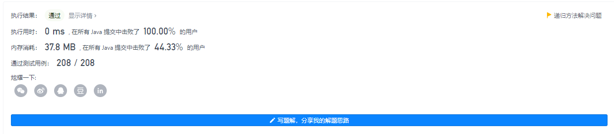

# 力扣习题 

`-始于2021年9月12日`

## [1. 两数之和](https://leetcode-cn.com/problems/two-sum/)

难度简单12088收藏分享切换为英文接收动态反馈

给定一个整数数组 `nums` 和一个整数目标值 `target`，请你在该数组中找出 **和为目标值** *`target`* 的那 **两个** 整数，并返回它们的数组下标。

你可以假设每种输入只会对应一个答案。但是，数组中同一个元素在答案里不能重复出现。

你可以按任意顺序返回答案。

 

**示例 1：**

```
输入：nums = [2,7,11,15], target = 9
输出：[0,1]
解释：因为 nums[0] + nums[1] == 9 ，返回 [0, 1] 。
```

**示例 2：**

```
输入：nums = [3,2,4], target = 6
输出：[1,2]
```

**示例 3：**

```
输入：nums = [3,3], target = 6
输出：[0,1]
```

 

**提示：**

- `2 <= nums.length <= 104`
- `-109 <= nums[i] <= 109`
- `-109 <= target <= 109`
- **只会存在一个有效答案**

**进阶：**你可以想出一个时间复杂度小于 `O(n2)` 的算法吗？


**解题：1 暴力法 2 哈希表法** 

> 有人相爱，有人夜里开车看海，有人leetcode第一题都做不出来。

1. 暴力法

   ```java
   public int[] handler1(int[] nums,int target){ // 1 直接便利法
       for (int i = 0; i < nums.length; i++) {
           for (int j = i+1; j < nums.length; j++) {
               if (nums[i] + nums[j] == target)
                   return new int[]{i,j};
           }
       }
       return null;
   }
   ```

2. 哈希表法

   ```java
   public int[] handler2(int[] nums,int target){ // 2 哈希表法
       HashMap<Integer, Integer> hashMap = new HashMap<>();
       for (int i = 0; i < nums.length; i++) {
           hashMap.put(nums[i], i);// 添加键值对 [key为数组中值，value是索引位置]
       }
       for (int i = 0; i < nums.length; i++) {
   
           int myTarget = target-nums[i];
           Integer index = hashMap.get(myTarget);
           if (index != null && i != index){
               return new int[]{i,index};
           }
   
           //            if ((index = hashMap.get(target-nums[i])) != null)
           //                return new int[]{i,index};
       }
       return null;
   }
   ```

   

## [2. 两数相加](https://leetcode-cn.com/problems/add-two-numbers/)

难度中等6745收藏分享切换为英文接收动态反馈

给你两个 **非空** 的链表，表示两个非负的整数。它们每位数字都是按照 **逆序** 的方式存储的，并且每个节点只能存储 **一位** 数字。

请你将两个数相加，并以相同形式返回一个表示和的链表。

你可以假设除了数字 0 之外，这两个数都不会以 0 开头。

 

**示例 1：**


```
输入：l1 = [2,4,3], l2 = [5,6,4]
输出：[7,0,8]
解释：342 + 465 = 807.
```

**示例 2：**

```
输入：l1 = [0], l2 = [0]
输出：[0]
```

**示例 3：**

```
输入：l1 = [9,9,9,9,9,9,9], l2 = [9,9,9,9]
输出：[8,9,9,9,0,0,0,1]
```

 

**提示：**

- 每个链表中的节点数在范围 `[1, 100]` 内
- `0 <= Node.val <= 9`
- 题目数据保证列表表示的数字不含前导零

通过次数986,690

提交次数2,416,045

**解题：1 迭代法，2递归法**

> 爱可抵岁月漫长。

1. 迭代法

   ```java
   public ListNode addTwoNumbers1(ListNode l1, ListNode l2) { // 迭代法
       ListNode answerList = new ListNode();
       ListNode currentP = answerList;
       int num = 0;
   
       while (l1 != null || l2 != null || num != 0){
           currentP.val = ((l1 != null)?l1.val:0) + ((l2 != null)?l2.val:0) + num;
           num = 0;
           if (currentP.val >= 10){
               num = currentP.val / 10;
               currentP.val %= 10;
           }
           System.out.print(" --> currentP = " + currentP.val);
           l1 = l1 != null ? l1.next : null;
           l2 = l2 != null ? l2.next : null;
           if (l1 != null || l2 != null || num != 0){
               currentP.next = new ListNode();
               currentP = currentP.next;
           }
       }
       System.out.println();
       return answerList;
   }
   ```

   

2. 递归法

   ```java
   public ListNode addTwoNumbers2(ListNode l1, ListNode l2) { // 递归法
       return rrun(l1,l2,0);
   }
   
   public ListNode rrun(ListNode l1, ListNode l2,int num){
       ListNode answerList = new ListNode();
       if (l1 == null && l2 == null && num == 0)
           return null;
       answerList.val = ((l1 != null)?l1.val:0) + ((l2 != null)?l2.val:0) + num;
       num = 0;
       if (answerList.val >= 10){
           num = answerList.val / 10;
           answerList.val %= 10;
       }
       System.out.println("answerList = " + answerList.val);
       l1 = l1 != null ? l1.next : null;
       l2 = l2 != null ? l2.next : null;
       answerList.next = rrun(l1,l2,num);
       return answerList;
   }
   ```


## [20. 有效的括号](https://leetcode-cn.com/problems/valid-parentheses/)

难度简单2645收藏分享切换为英文接收动态反馈

给定一个只包括 `'('`，`')'`，`'{'`，`'}'`，`'['`，`']'` 的字符串 `s` ，判断字符串是否有效。

有效字符串需满足：

1. 左括号必须用相同类型的右括号闭合。
2. 左括号必须以正确的顺序闭合。

 

**示例 1：**

```
输入：s = "()"
输出：true
```

**示例 2：**

```
输入：s = "()[]{}"
输出：true
```

**示例 3：**

```
输入：s = "(]"
输出：false
```

**示例 4：**

```
输入：s = "([)]"
输出：false
```

**示例 5：**

```
输入：s = "{[]}"
输出：true
```

 

**提示：**

- `1 <= s.length <= 104`
- `s` 仅由括号 `'()[]{}'` 组成

通过次数767,508

提交次数1,725,237

使用栈解决这个问题

```java
public boolean isValid(String s) { // 使用栈轻松解决这个问题 java栈 Stack 也可使用数组自建一个栈
    Stack<Character> stack = new Stack<>();
    for (int i = 0; i < s.length(); i++) {
        char character = s.charAt(i);
        if (character == ')' || character == '}' || character == ']'){
            if (stack.isEmpty())
                return false; // 如果栈已经为空，直接结束
            switch (stack.pop()){
                case '(':
                    if (character != ')')
                        return false;
                    break;
                case '{':
                    if (character != '}')
                        return false;
                    break;
                case '[':
                    if (character != ']')
                        return false;
                    break;
                default:return false;
            }
        }else {
            stack.push(character);
        }
    }
    return stack.isEmpty();
}
```


## [21. 合并两个有序链表](https://leetcode-cn.com/problems/merge-two-sorted-lists/)

难度简单1912收藏分享切换为英文接收动态反馈

将两个升序链表合并为一个新的 **升序** 链表并返回。新链表是通过拼接给定的两个链表的所有节点组成的。 

 

**示例 1：**


```
输入：l1 = [1,2,4], l2 = [1,3,4]
输出：[1,1,2,3,4,4]
```

**示例 2：**

```
输入：l1 = [], l2 = []
输出：[]
```

**示例 3：**

```
输入：l1 = [], l2 = [0]
输出：[0]
```

 

**提示：**

- 两个链表的节点数目范围是 `[0, 50]`
- `-100 <= Node.val <= 100`
- `l1` 和 `l2` 均按 **非递减顺序** 排列

通过次数698,342

提交次数1,046,588

> 两种办法解决问题，迭代法和递归法

**迭代法代码**

```java
public ListNode mergeTwoLists(ListNode l1, ListNode l2) { // 第一种迭代法， 不要忘记操作链表，最少两个指针
    ListNode answerList = new ListNode();
    ListNode currentP = answerList;
    while (l1 != null || l2 != null){ // 每次比较两个点的值，考虑到有可能出现空的情况
        int a = l1 != null ? l1.val : 101;
        int b = l2 != null ? l2.val : 101;
        if (a <= b){
            currentP.val = a;
            l1 = l1 != null? l1.next : null;
        }else {
            currentP.val = b;
            l2 = l2 != null? l2.next : null;
        }
        System.out.println("answerList -->" + currentP.val);
        if (l1 == null && l2 == null)
            return answerList;
        currentP.next = new ListNode();
        currentP = currentP.next;
    }
    return null;
}
```


**递归法**

```java
public ListNode mergeTwoLists2(ListNode l1, ListNode l2) { // 第二种方法，递归
    return run(l1,l2);
}

public ListNode run(ListNode l1, ListNode l2){ // 这里的想法还是，最后的结果是每次相加出来的。
    if (l1 == null && l2 == null)
        return null;
    int a = l1 != null ? l1.val : 101;
    int b = l2 != null ? l2.val : 101;
    ListNode answerList = new ListNode();
    if (a <= b){
        answerList.val = a;
        l1 = l1 != null? l1.next : null;
    }else {
        answerList.val = b;
        l2 = l2 != null? l2.next : null;
    }
    System.out.print("answerList = " + answerList.val);
    answerList.next = run(l1,l2);
    return answerList;
}
```

`无聊的结果🤣`




## [22. 括号生成](https://leetcode-cn.com/problems/generate-parentheses/)

难度中等2040

数字 `n` 代表生成括号的对数，请你设计一个函数，用于能够生成所有可能的并且 **有效的** 括号组合。

有效括号组合需满足：左括号必须以正确的顺序闭合。

 

**示例 1：**

```
输入：n = 3
输出：["((()))","(()())","(())()","()(())","()()()"]
```

**示例 2：**

```
输入：n = 1
输出：["()"]
```

 

**提示：**

- `1 <= n <= 8`

通过次数344,284

提交次数445,629

```java
public List<String> generateParenthesis(int n) { // 使用递归方式解决这个问题，遇到不可的情况直接跳过
    ArrayList<String> answerList = new ArrayList<>();
    run(n,answerList,0,0,"");
    return answerList;
}

private void run(int n,List<String> answerList,int left,int right,String str){
    if (right > left)
        return;
    if (right == left && right == n){
        answerList.add(str);
        return;
    }
    if (left < n)
        run(n,answerList,left+1,right,str + "(");
    if (left > right)
        run(n,answerList,left,right+1,str + ")");
}
```


## [24. 两两交换链表中的节点](https://leetcode-cn.com/problems/swap-nodes-in-pairs/)

难度中等1044收藏分享切换为英文接收动态反馈

给定一个链表，两两交换其中相邻的节点，并返回交换后的链表。

**你不能只是单纯的改变节点内部的值**，而是需要实际的进行节点交换。

 

**示例 1：**


```
输入：head = [1,2,3,4]
输出：[2,1,4,3]
```

**示例 2：**

```
输入：head = []
输出：[]
```

**示例 3：**

```
输入：head = [1]
输出：[1]
```

 

**提示：**

- 链表中节点的数目在范围 `[0, 100]` 内
- `0 <= Node.val <= 100`

 

**进阶：**你能在不修改链表节点值的情况下解决这个问题吗?（也就是说，仅修改节点本身。）

通过次数310,958

提交次数442,205

```java
```

