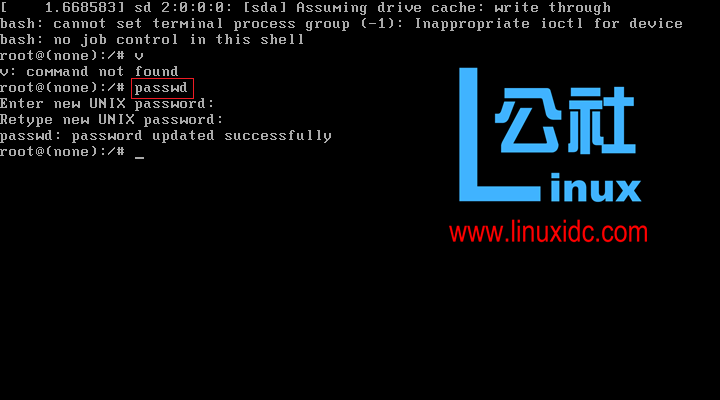

## [解决"authentication token manipulation error"](https://www.cnblogs.com/javaboy2018/p/8881591.html)

 

 昨天安装是Ubuntu Server. 配置好了几个软件后就忘记继续了...今天打开,居然忘记了密码...真是的..
 后来还是要改了. 不想重新弄什么的了..百度了下怎么改密码...然后就有一篇文章说是在进入系统前进入高级模式..然后里面有root的单用户模式..-----kohna,

1).在启动项选择:Advaned options for Ubuntu. 
2).然后 选择:Ubuntu ,with Linux 3.13.0-24-generic (recovery mode),
3). 等待加载完成..你将看到"Recovery Menu (filesystem state :read-only)"
4).选择root        Drop to root shell prompt 就会进入单用户模式了..

然后是修改密码.
输入passwd user,回车后就出现 
 authentication token manipulation error.
passwd unchanged..

接下来我就在不断的尝试....
找了很多文章看...CSDN,网易的什么都有

后来找到了一篇外国人写的... 
http://linhost.info/2013/08/passwd-authentication-token-manipulation-error-ubuntu/

You probably encountered this error while trying to reset the password on a Ubuntu system.

 root@u13-04:~# passwd nyuser 
 Enter new UNIX password: 
 Retype new UNIX password: 
 passwd: Authentication token manipulation error 
 passwd: password unchanged

This is the result of trying to work on a file system while mounted as read-only. The solution is a simple one. Before making changes to the users password mount the filesystem as read-write which allows for the necessary changes to be made.
 

mount -o rw,remount /

Now try to change the users passwords again.

root@u13-04:~# passwd nyuser Enter new UNIX password: 
Retype new UNIX password: 
passwd: password updated successfully

关键代码是:mount -o rw,remount / .
输入后就可以改了..注意..输入后什么也不会提示.

 

**[Ubuntu](http://www.linuxidc.com/topicnews.aspx?tid=2) 14.04中root 密码忘记解决方法**

**方法一**：

如果用户具有sudo权限，那么直接可以运行如下命令：

\#sudo su root

\#passwd

\#更改密码

或者直接运行sudo passwd root命令就可以直接更改root密码。

有关sudo su的区别：

1.共同点：都是root用户的权限；

2.不同点：su仅仅取得root权限，工作环境不变，还是在切换之前用户的工作环境；sudo是完全取得root的权限和root的工作环境。

www.linuxidc.com@linuxidc:~$ sudo su root
[sudo] password for www.linuxidc.com: 
root@linuxidc:/home/www.linuxidc.com# passwd
输入新的 UNIX 密码： 
重新输入新的 UNIX 密码： 
passwd：已成功更新密码
root@linuxidc:/home/www.linuxidc.com#

**方法二**：

如果用户不具备sudo权限，则方法一不能用，并需进入GRUB修改kernel镜像启动参数。本文使用的Ubuntu版本为14.04.4，具体过程如下为：

1、重启电脑长按shift键直到进入下图进入GRUB引导模式，选择第二行Ubuntu 高级选项, 选中直接回车 ，如下图：

 

2、进入如下画面，看到里面有一些选项，这时千万不要按回车键，按**e**进入（recovery mode） 编译kernel进行启动参数

3、关键的时候到了， 倒数第四行，会看到一行Linux /boot/vmlnuz-4.2.0-27-generic .......ro recovery nomodeset，

**删除**recovery nomodeset

3、然后再刚才删除的后面**添加** quiet splash rw init=/bin/bash。然后按F10, 启动。

4 如果一切争取，运行后系统直接进入root mode，输入：passwd，系统会提示你输入新的密码，结束。

 