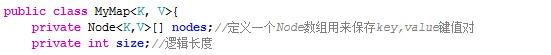

# JAVA 常见问题

## JAVA 基础

### 1.String 类为什么是final的

> - 使用final确保不能被继承
> - 用于存储字符串值的char[]数组用private和final修饰，其中，final可以保证value的引用地址不会被修改，但是不能保证数组中的值不会被修改，而配合private修饰符，能够保证值不会被外部修改。这样就能保证String类的不可变性。
>
> 不可变性的好处
> String类的不可变性带来的好处总结主要有两点：
>
> - 因为String类的不可变性，才能使得JVM可以实现字符串常量池；字符串常量池可以在程序运行时节约很多内存空间，因为不同的字符串变量指向相同的字面量时，都是指向字符串常量池中的同一个对象。这样一方面能够节约内存，另一方面也提升了性能。
>
> - 因为String类的不可变性，从而保证了字符串对象在多线程环境下是线程安全的。如果String类是可变的，那么会引起很严重的安全问题。我们在很多情况下都是直接通过字符串传递数据，比如数据库的用户名密码、网络编程中的ip和端口，因为字符串是不可变的，所以它的值不能被修改，如果字符串是可变的，那么可以通过改变引用地址指向的值去修改字符串的值，从而导致安全漏洞


### 2.HashMap的源码，实现原理，底层结构。

> hashMap的底层实际上是数组+链表的形式，这个数组的一个值就是实现了Map


### 3.说说你知道的几个Java集合类：list、set、queue、map

Collection 接口的接口 对象的集合（单列集合）
├——-List 接口：元素按进入先后有序保存，可重复
│—————-├ LinkedList 接口实现类， 链表， 插入删除， 没有同步， 线程不安全
│—————-├ ArrayList 接口实现类， 数组， 随机访问， 没有同步， 线程不安全
│—————-└ Vector 接口实现类 数组， 同步， 线程安全
│ ———————-└ Stack 是Vector类的实现类
└——-Set 接口： 仅接收一次，不可重复，并做内部排序
├—————-└HashSet 使用hash表（数组）存储元素
│————————└ LinkedHashSet 链表维护元素的插入次序
└ —————-TreeSet 底层实现为二叉树，元素排好序

Map 接口 键值对的集合 （双列集合）
├———Hashtable 接口实现类， 同步， 线程安全
├———HashMap 接口实现类 ，没有同步， 线程不安全-
│—————–├ LinkedHashMap 双向链表和哈希表实现
│—————–└ WeakHashMap
├ ——–TreeMap 红黑树对所有的key进行排序
└———IdentifyHashMap


### 4.描述一下ArrayList和LinkedList各自实现和区别

 1.ArrayList是实现了基于动态数组的数据结构，LinkedList基于链表的数据结构。 
     2.对于随机访问get和set，ArrayList觉得优于LinkedList，因为LinkedList要移动指针。 
     3.对于新增和删除操作add和remove，LinedList比较占优势，因为ArrayList要移动数据。


从内部实现机制来讲ArrayList和Vector都是使用Objec的数组形式来存储的。当你向这两种类型中增加元素的时候，如果元素的数目超出了内部数组目前的长度它们都需要扩展内部数组的长度，Vector缺省情况下自动增长原来一倍的数组长度，ArrayList是原来的50%,所以最后你获得的这个集合所占的空间总是比你实际需要的要大。所以如果你要在集合中保存大量的数据那么使用Vector有一些优势，因为你可以通过设置集合的初始化大小来避免不必要的资源开销。 

### 5.Java中的队列有哪些，有什么区别。

`ArrayBlockingQueue`、`LinkedBlockingQueue`、`PriorityQueue`、`DelayQueue`、`SynchronousQueue`

- 阻塞与非阻塞 **BlockingQueu** 关键字
- 有界队列和无界队列 
- 按功能分类
  - 普通队列
  - 双端队列
  - 优先队列
  - 延迟队列
  - 其他队列\同步队列？


### 6.反射中，Class、ForName和classOrder的区别，Class、forName对之行静态代码块


### 7、Java7、Java8的新特性(baidu问的,好BT)

### 8、Java数组和链表两种结构的操作效率，在哪一情况下(从开头开始，从结尾开始，从中升),哪些操作(插入，查找，删除)的效率高

### 9、Java内存泄露的问题调查定位: jmap， jstack的使用等等

### 10、string、stringbuilder、stringbuffer 区别11、hashtable和hashmap 的区别

> **String**：字符串常量，字符串长度不可变。

### 13、异常的结构，运行时异常和非运行时异常，各举个例子

### 14、Stringa=*abc""Stringb="abc"Stringc=newString( abc3)Stringd=*ab"'+"c?、他们之间用=-比较的结果

== 比较的是地址

```shell
["abc"]		==	[new String("abc")] 	:false
["ab"+"c"]	==	[new String("abc")] 	:false
["abc"]		==	["ab"+"c"] 				:true
["abc"]		==	["abc"] 				:true
```


两种创建方法的区别：

1. String str1= “abc”； 在编译期，JVM会去常量池来查找是否存在“abc”，如果不存在，就在常量池中开辟一个空间来存储“abc”；如果存在，就不用新开辟空间。然后在栈内存中开辟一个名字为str1的空间，来存储“abc”在常量池中的地址值。

2. String str2 = new String("abc") ;在编译阶段JVM先去常量池中查找是否存在“abc”，如果过不存在，则在常量池中开辟一个空间存储“abc”。在运行时期，通过String类的构造器在堆内存中new了一个空间，然后将String池中的“abc”复制一份存放到该堆空间中，在栈中开辟名字为str2的空间，存放堆中new出来的这个String对象的地址值。

也就是说，前者在初始化的时候可能创建了一个对象，也可能一个对象也没有创建；后者因为new关键字，至少在内存中创建了一个对象，也有可能是两个对象。


### 15、String类的常用方法

### 16、Java的引用类型有哪几种

### 17、抽象类和接口的区别

> - 共同点：
>   - 都不能被实例化，用于被其他类实现和继承
>   - 都可以包含抽象方法
> - 区别
>   - 抽象类中可以包含普通方法，而接口只能通过default实现普通方法
>   - 抽象类中的成员变量可以是各种类型的，而接口中只能为public static final 而且必须赋值
>   - 接口不能有构造器，而抽象类可以。(抽象类里的构造器并不是用于创建对象，而是**让其子类调用这些构造器**来**完成**属于**抽象类的初始化操作**。)
>   - 接口里不能包含初始化块，但抽象类里完全可以包含**初始化块**。
>   - 一个类只能继承一个抽象类，而一个类却可以实现多个接口。

### 18、java的基础类型和字节大小。

> 八种基本类型：
>
> - byte	一字节
> - short  二字节
> - int       四字节
> - long    八字节
> - char    两字节
> - float    四字节
> - double 八字节
> - boolean 1bit


### 19、Hashtable,HashMap,ConcurrentHashMap 底层实现原理与线程安全问题(建议熟悉jdk源码，才能从容应答)

### 2o、如果不让你用JavaJdk提供的工具，你自己实现一个Map，你怎么做。

> 

### 21、Hash冲突怎么办?哪些解决散列冲突的方法?

### 22、HashMap 冲突很厉害，最差性能，你会怎么解决?从o (n)提升到log (n)咯，用二叉排序树的思路说了一通

### 23、rehash

### 24、hashCode()与equals()生成算法、方法怎么重写

## 二、JavaIO

### 1、讲讲IO里面的常见类，字节流、字符流、接口、实现类、方法阻塞。

### 2、讲讲NIO。

### 3、String编码UTF-8和GBK的区别?

### 4、什么时候使用字节流、什么时候使用字符流?

### 5、递归读取文件夹下的文件，代码怎么实现

## 三、JavaWeb

### 1、session和cookie的区别和联系，session的生命周期，多个服务部署时session管理。

> cookie和[session](https://so.csdn.net/so/search?q=session&spm=1001.2101.3001.7020)都是用来跟踪浏览器用户身份的会话方式。
>
> - cookie 保存在客户端，是每次访问服务器时的令牌
> - session 保存在服务端，给客户端一个特殊的cookie(JSESSIONID),并且此cookie 关闭浏览器即消失，默认存活30分钟

### 2、servlet的一些相关问题

### 3、 webservice相关问题

### 4、jdbc连接,forname方式的步骤，怎么声明使用一个事务。举例并具体代码

### 5、无框架下配置web、xm1的主要配置内容

### 6、jsp和servlet的区别

## 四、JVM

### 1、Java的内存模型以及GC算法2、jvm性能调优都做了什么

### 3、介绍JVM中7个区域,然后把每个区域可能造成内存的溢出的情况说明

### 4、介绍GC和GCRoot不正常引用。

### 5、自己从classload加载方式，加载机制说开去，从程序运行时数据区，讲到内存分配，讲到String常量池，讲到JVM垃圾回收机制，算法,hotspot。反正就是各种扩展

### 6、jvm如何分配直接内存，new对象如何不分配在堆而是栈上，常量池解析

### 7、数组多大放在JVM老年代(不只是设置PretenureSizeThreshold，问通常多大，没做过一问便知)

### 8、老年代中数组的访问方式

### 9、GC 算法，永久代对象如何GC,GC有环怎么处理

### 10、谁会被GC，什么时候GC11、如果想不被GC怎么办

### 12、如果想在GC中生存1次怎么办五、开源框架

## 五、开源框架

### 1、hibernate和 ibatis的区别

### 2、讲讲mybatis的连接池。

### 3、spring框架中需要引用哪些jar包，以及这些jar包的用途

### 4、springMVC的原理

> MVC是 model、view、和controller的缩写，分别代表web应用程序中的三种职责：
>
> - model-模型：用于存储数据以及能处理用户请求的业务逻辑
> - view-视图：向控制器提交数据，显示模型中的数据
> - controller-控制器：根据视图提出的请求，判断将请求和数据交给哪个模型处理，处理后的有关结果交给哪个视图更新显示

### 5、springMVC注解的意思

### 6、spring 中beanFactory和ApplicationContext的联系和区别

> **ApplicationContext：** 继承自 **BeanFactory**，更高级，提供了更多的功能。AOP,消息发送、响应机制（ApplicationEventPublisher）,而**BeanFactory：**
>
> 是Spring里面最低层的接口，提供了最简单的容器的功能，只提供了实例化对象和拿对象的功能；

### 7、spring注入的几种方式(循环注入)

- 接口注入

- setter方法注入
- 构造方法注入
- 注解方式注入

### 8、spring 如何实现事务管理的

### 9、springIOC

IOC-控制反转，是一个重要的面向对象编程的法则来消减计算机程序的耦合问题。

### 10、springAOP的原理

> AOP 代理其实是由 AOP 框架动态生成的一个对象，该对象可作为目标对象使用。
> AOP 代理包含了目标对象的全部方法，但 AOP 代理中的方法与目标对象的方法存在差异：AOP 方法在特定切入点添加了增强处理，并回调了目标对象的方法。
>
>
> Spring 的 AOP 代理由 Spring 的 IoC 容器负责生成、管理，其依赖关系也由 IoC 容器负责管理。因此，AOP 代理可以直接使用容器中的其他 Bean 实例作为目标，这种关系可由 IoC 容器的依赖注入提供。
>
> aop开发时，其中需要参与开发的只有 3 个部分：
>
> 定义普通业务组件。
> 定义切入点，一个切入点可能横切多个业务组件。
> 定义增强处理，增强处理就是在 AOP 框架为普通业务组件织入的处理动作。

### 11、hibernate 中的1级和2级缓存的使用方式以及区别原理(Lazy-Load的理解)