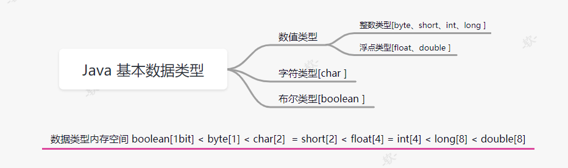
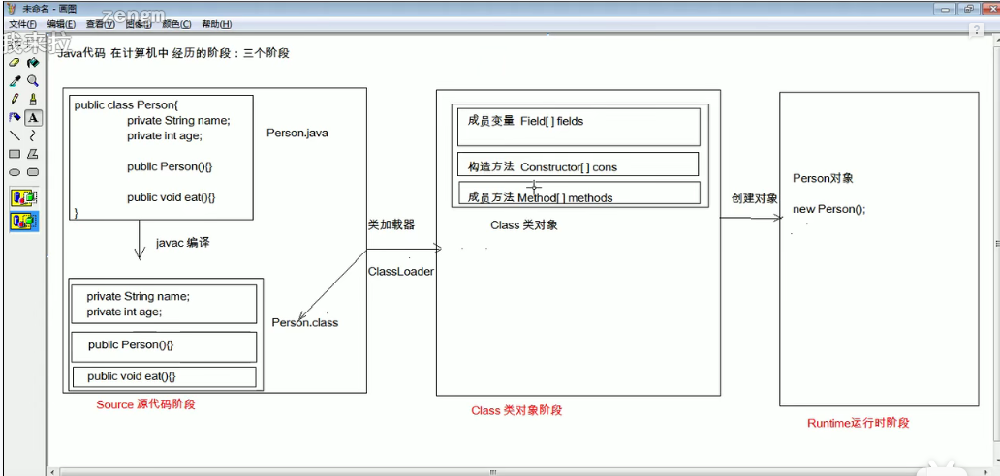

# Java知识储备


## Java语言基础

> java语言是面向对象的程序设计语言，**Java程序的基本组成单位是类。**类体中又包含属性与方法两部分。每一个应用程序可以有多个类组成，但必须有一个main()方法，含有main()方法的类称为主类。

### 基本数据类型

> Java中有8中基本数据类型来存储数值、字符和布尔值。

​	

### 变量和常量

#### 标识符和关键字

1. 标识符

   也就是一个名字，用来区分不同的类、变量、方法、数组或文件

   **java语言规定标识符由任意顺序的字母、下划线(_)、美元符($)、和数字组成,并且第一个字符不能是数字**

   `name user_age $page | 4word String User Name`

   在java语言中大小写被区分,即变量‘user ’与变量‘User’表示两个变量

2. 关键字

   关键字指java语言中已经用来表达特定含义的一些字符，这些字符不能用来作为标识符。

   ```java
     abstract assert boolean break byte case catch char class continue default do double 
   else enum extends final finally float for if implements import int interface instanceof 
     long native new package private protected public return short static strictfp super 
           switch synchronized this throw throws transient try void volatile while
   ```

#### 声明变量

#### 变量的有效范围

### 运算符

1. 赋值运算符
2. 算术运算符
3. 自增和自减运算符
4. 比较运算符
5. 逻辑运算符
6. 位运算符
7. 三元运算符

> 运算符优先级

### 数据类型转换


### 代码注释与编码规范

1. 代码注释

2. 编码规范

   > 在学习开发的过程中要养成良好的编码习惯，因为规范的代码格式会给程序的开发与日后的维护提供很大方便。


## 流程控制

### 复合语句

**静态代码块和普通代码块的区别**

> [(3条消息) 【Java】静态和非静态的区别_小白博客-CSDN博客_静态和非静态的区别](https://blog.csdn.net/qq_20617983/article/details/81636333)

### 条件语句

### 循环语句

### 循环控制


## 反射

> 反射访问构造方法，反射访问成员变量，反射访问方法，定义Annotation类型，访问Annotaion信息

`反射流程图`

****


- 获取class对象 `三种`

  ```java
  Class cls = Class.forName("传智播客_黑马.java高级.reflect反射.Person"); // 包名 Class.forName
  Class<Person> personClass = Person.class; // 类型.class
  Class aClass = new Person().getClass(); // 对象 getClass
  ```

- 获取构造器 constructor

  ```java
  Constructor<Person> constructor = personClass.getConstructor(String.class, int.class); // 有参构造
  Constructor<Person> constructor1 = personClass.getConstructor(); // 无参构造
  ```

  

- 获取成员变量 field

  ```java
  Field name = personClass.getDeclaredField("name");
  Person person = new Person();
  name.setAccessible(true); //无视权限(暴力反射)
  System.out.println(name.get(person)); //name.get(实例对象):获取这个/访问
  name.set(person,"小艾同学"); //对某个成员变量进行改变：name.set(实例对象，赋值给成员变量的值)
  System.out.println(name.get(person));
  System.out.println(person);
  ```

  

- 获取方法 method

  ```java
   Class对象.getMethod("sleep");// 获取无参方法
   Class对象.getMethod("sleep",int.class);// 获取有参方法
   Method eat1 = c.getDeclaredMethod("sleep"); // 这个可以获取私有方法
   Method[] methods = c.getMethods();//会获取到所有的public 方法,同时也会包括父类的一些方法
   Method[] methods1 = c.getDeclaredMethods();//只会获取类的的方法(包括私有)，没有父类的
  ```

- 执行函数

  ```java
  eat.setAccessible(true); // 如果有私有权限修饰
  eat.invoke(person); // 运行函数，可以在后面添加参数。
  ```

  

## 注解

```java
jdk中预定义的一些注解
    @Override : 检测被该注解标注的方法时候继承自父类
    @Deprecated : 表示该注解标注的内容已经过时
    @SupperssWarnings : 压制警告，不再警告
```

- 自定义一个注解：

  格式：

  ​	元注解 public @interface 注解名称{}
  
  TODO


## 线程

