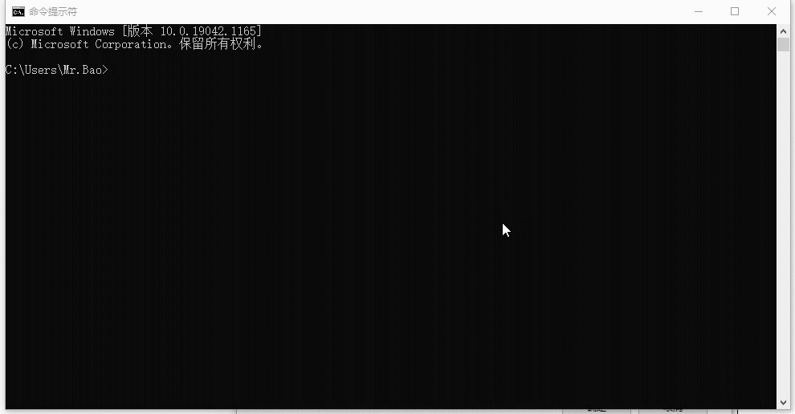
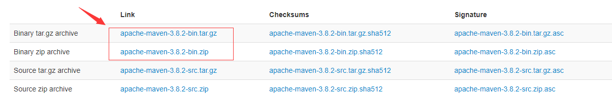
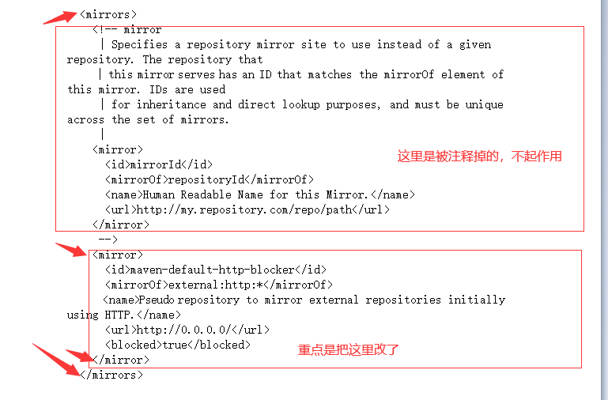
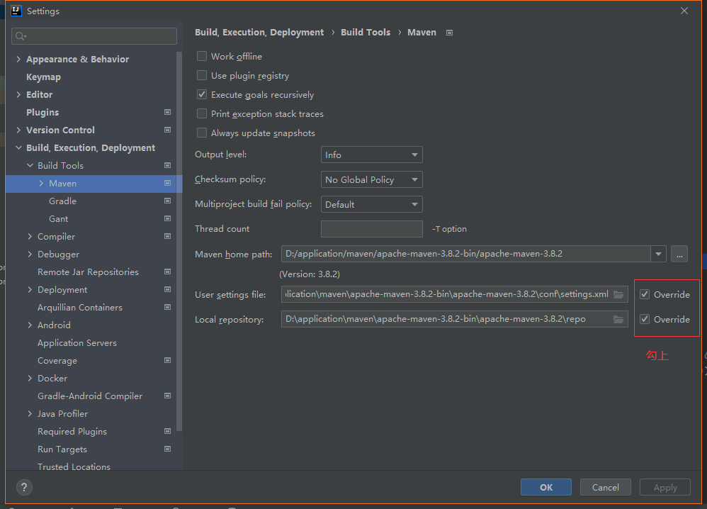

# 安装日志

> 此文件用于收集我所有的安装日志,希望以后能帮到自已或其他人

[TOC]


## 安装JDK - windows

> 花几分钟的时间安装一下jdk(java development kit)
>
> 下面的链接如果不能单机，尝试摁住control + 鼠标左键点击

**准备工作**

- 下载jdk安装包 [跳转到官网👉](https://www.oracle.com/cn/java/technologies/javase-downloads.html)

  下载你想要安装的jdk版本 例如jdk8

  

  

- 选择Windows的安装包 （32 或 64位）`windows x64指的是64位操作系统，[x86](http://www.windows7en.com/it/49006.html)指的是32位操作系统。`

  [点击查看你的系统版本👉](ms-settings:about)

  

- 下载对应位数的安装包

  

**开始安装**

- 

  `ps 安装到一般时弹出的弹窗是安装jre(Java运行时环境)的，jdk自带不用重复安装`

- 配置环境变量

  打开[关于👉](ms-settings:about) --> 高级系统设置 --> 环境变量

  

  在系统变量一栏中

  新建 JAVA_HOME 变量 -- 变量默认值为 (如果你更改了你的环境变量请写你自己的，我的是d:\applica ……)D:\application\Java\jdk1.8.0_301

  新建CLASS_PATH 变量 -- 变量值为 `.;%JAVA_HOME%\lib\dt.jar;%JAVA_HOME%\lib\tools.jar`

  修改path 变量 -- 在最顶部添加 `%JAVA_HOME%\bin`

  

- 验证安装

  打开命令行窗口 摁住**开始键** + R 键 输入 `cmd` 

  
  

`显示结果像上面这样就算安装完成`

## piggo + gitee实现私人图床

`csdn 还有pigo 基本不支持5m以上的gif图片，并且在typora 上的gif无法加载，所以不建议。`

**下载安装包**

[Releases · Molunerfinn/PicGo · GitHub](https://github.com/Molunerfinn/PicGo/releases)

**开始安装**

**详细教程看这里👉**[(11条消息) 使用 Gitee+PicGo 快速搭建个人图床_x-dragon8899的博客-CSDN博客](https://blog.csdn.net/m0_45234510/article/details/115125528)


## 安装nodejs

[下载 | Node.js 中文网 (nodejs.cn)](http://nodejs.cn/download/)

下载对应位数的安装包，一路next即可

A

## 安装git

[Git (git-scm.com)](https://git-scm.com/)

正常使用一直点next就可以


## 安装mysql - windows

public class Mysql安装 {
//此乃重中之重
//1 解压安装包(目录不要有中文,否则有惊喜)
//2 去掉后面的后缀
//3 配置环境变量
// path 中添加mysql的文件目录(到bin)
//4 新建mysql配置文件（和bin目录同一层）
// my.ini
// [mysqld]
// basedir=Mysql文件目录(正斜杠用一个,双斜杠用两个)
// datadir=Mysql文件目录\data\(正斜杠用一个,反斜杠用两个)
// port=3306
// skip-grant-tables
//5 以管理员模式打开cmd(开始按钮搜索cmd,鼠标右键选择 以管理员模式启动)
//6 安装mysql
// 命令行输入mysqld --install
//7 初始化数据文件
// mysqld --initialize-insecure --user=mysql

net start mysql

mysqladmin -u root -p password 123456

// mysql -uroot -p(回车)
// password : (输入刚才设置的密码,回车)

//8 修改密码(mysql中)

// ALTER USER 'root'@'localhost' IDENTIFIED BY '新密码';


//8 进入mysql
// mysql -uroot -p(回车)
// password : (输入刚才设置的密码,回车)
//9 退出mysql(exit),重启mysql服务
// net stop mysql(回车)
// net start mysql(回车)
// 服务启动成功:(如果不成功,可能是没在管理员模式打开)

// 总结,过程看似简单,但是却可能会产生各种各样的错误,如果发生了一些baidu不到的错误建议卸载重装

//mysqld -remove MySQL

// 卸载重装步骤:首先关闭服务,删除所有解压的文件,
// 我当时也经历了这个过程,百度一般不管用,因为我们是通过命令行安装的,和大部分回答不符
// WIndows + R 打开 regedit 搜索(ctrl + f)mysql将mySQL删掉,就成了.然后重新来过吧.
}

## 安装maven

[下载地址👉]([Maven – Download Apache Maven](https://maven.apache.org/download.cgi))



windows选**.zip**，linux选择**.gz**

 **开始安装**

> 找到下载好的安装包，打开其中conf目录下的settings.xml(在这个文件上右键编辑) 有条件的可以去安装一个notepad++软件，很方便
>
> 
>
> 把下边方块中的内容替换成这些代码
>
> ```xml
> <mirror>
>     <id>aliyun-public</id>
>     <mirrorOf>*</mirrorOf>
>     <name>aliyun public</name>
>     <url>https://maven.aliyun.com/repository/public</url>
> </mirror>
> 
> <mirror>
>     <id>aliyun-central</id>
>     <mirrorOf>*</mirrorOf>
>     <name>aliyun central</name>
>     <url>https://maven.aliyun.com/repository/central</url>
> </mirror>
> 
> <mirror>
>     <id>aliyun-spring</id>
>     <mirrorOf>*</mirrorOf>
>     <name>aliyun spring</name>
>     <url>https://maven.aliyun.com/repository/spring</url>
> </mirror>
> 
> <mirror>
>     <id>aliyun-spring-plugin</id>
>     <mirrorOf>*</mirrorOf>
>     <name>aliyun spring-plugin</name>
>     <url>https://maven.aliyun.com/repository/spring-plugin</url>
> </mirror>
> 
> <mirror>
>     <id>aliyun-apache-snapshots</id>
>     <mirrorOf>*</mirrorOf>
>     <name>aliyun apache-snapshots</name>
>     <url>https://maven.aliyun.com/repository/apache-snapshots</url>
> </mirror>
> 
> <mirror>
>     <id>aliyun-google</id>
>     <mirrorOf>*</mirrorOf>
>     <name>aliyun google</name>
>     <url>https://maven.aliyun.com/repository/google</url>
> </mirror>
> 
> <mirror>
>     <id>aliyun-gradle-plugin</id>
>     <mirrorOf>*</mirrorOf>
>     <name>aliyun gradle-plugin</name>
>     <url>https://maven.aliyun.com/repository/gradle-plugin</url>
> </mirror>
> 
> <mirror>
>     <id>aliyun-jcenter</id>
>     <mirrorOf>*</mirrorOf>
>     <name>aliyun jcenter</name>
>     <url>https://maven.aliyun.com/repository/jcenter</url>
> </mirror>
> 
> <mirror>
>     <id>aliyun-releases</id>
>     <mirrorOf>*</mirrorOf>
>     <name>aliyun releases</name>
>     <url>https://maven.aliyun.com/repository/releases</url>
> </mirror>
> 
> <mirror>
>     <id>aliyun-snapshots</id>
>     <mirrorOf>*</mirrorOf>
>     <name>aliyun snapshots</name>
>     <url>https://maven.aliyun.com/repository/snapshots</url>
> </mirror>
> 
> <mirror>
>     <id>aliyun-grails-core</id>
>     <mirrorOf>*</mirrorOf>
>     <name>aliyun grails-core</name>
>     <url>https://maven.aliyun.com/repository/grails-core</url>
> </mirror>
> 
> <mirror>
>     <id>aliyun-mapr-public</id>
>     <mirrorOf>*</mirrorOf>
>     <name>aliyun mapr-public</name>
>     <url>https://maven.aliyun.com/repository/mapr-public</url>
> </mirror>
> ```
>
> 替换完成之后还需要再做一步，配置maven仓库，也就是平时你下载的依赖都会保存到这里
>
> <localRepository>D:\application\maven\apache-maven-3.8.2-bin\apache-maven-3.8.2\repo</localRepository>
>
> 找到这个标签，在下面添加一条，中间的值就是你想保存的位置。（如果编辑操作小心不要加到注释中去了，会没有用 `<!--这里是注释-->`）
>
> 之后就完事了，ideal中配置好就行了(在setting中搜索maven ,然后配置，像下面这样)**Override要选择上**
>
> 


## oracle 11g 的安装

> **安装系统：**`win 10 64位操作系统`
>
> [不会查看点击这里直接查看👉](ms-settings:about) `注意 设备规格下的 系统类型`

 **准备安装包**

> 因为企业版安装的选项比较全面，这里选用企业安装
>
> 1. 下载安装包
>
>    [👉百度网盘地址 fg2v](https://pan.baidu.com/s/18lYrkqqHG8u4aDdQekHc3g)
>
>    
>
> 2. 解压安装包
>
>    `运行setup.exe`
>    
>    
>

 **开始安装**

> 运行setup.exe

- 

- 

- 

- 

  > 口令:Oracle123

- 

**接下来进行口令管理**

- 

  > 　将sys和system的用户密码重新设置
  >
  > 　将sh和scott账号的勾去掉 并重新设置密码
  >
  > Oracle123

- 安装完成

