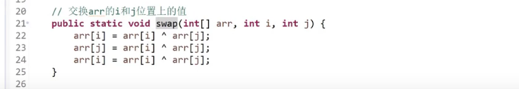

# 算法学习

[算法学习 哔哩哔哩_bilibili 👉](https://www.bilibili.com/video/BV13g41157hK?from=search&seid=10716945613420517144&spm_id_from=333.337.0.0)

## 1.认识复杂度和简单排序算法

> 和数据量无关的操作，我们称为常数操作
>
> 最终计算时间复杂度的时候，忽略低阶项。保留最高项，常数作1



> ^ 异或运算符
>
> 性质1
>
> ```java
> 0 ^ N = N;
> N ^ N = 0;
> ```
>
> 性质2 符合交换律，结合律
>
> s
>
> 交换a 和 b [前提是a和b的地址并非指向一处] 不建议这么写[0:36:05](https://www.bilibili.com/video/BV13g41157hK?p=2&spm_id_from=pageDriver&t=2165)
>
> ```java
> a = a ^ b;
> b = a ^ b;
> a = a ^ b;
> ```

1.  一个数组中只有一种数出现了奇数次，其他所有数出现了偶数次。怎么找到那个出现了基数次的数

   [第一题：0:43:21](https://www.bilibili.com/video/BV13g41157hK?p=2&spm_id_from=pageDriver&t=2601)

2. 数组中有两种数出现了奇数次，其他都出现了偶数次，要求时间复杂度O(n^2)，找出出现了奇数次的数字。

   [第二题：0:54:43](https://www.bilibili.com/video/BV13g41157hK?p=2&spm_id_from=pageDriver&t=3283)

