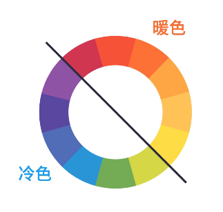
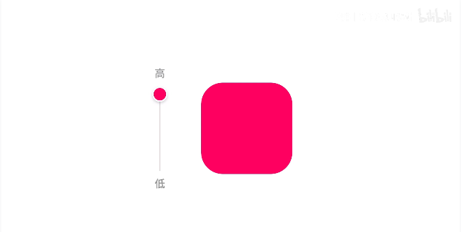
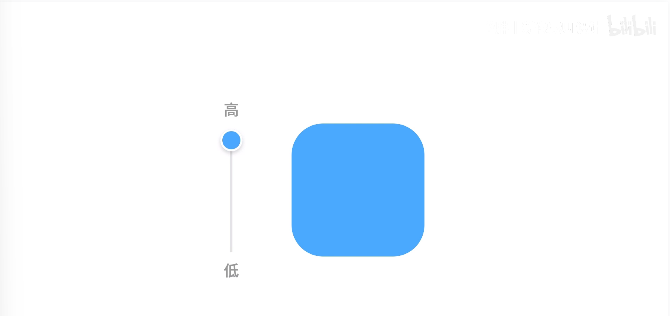
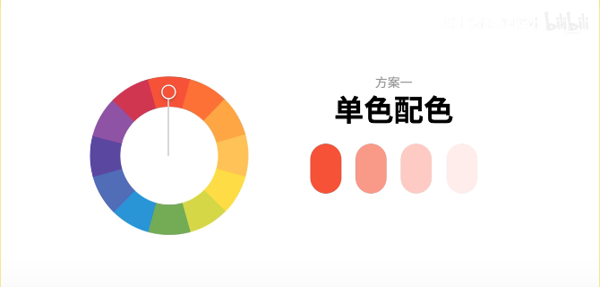
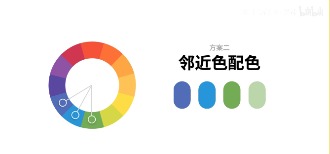
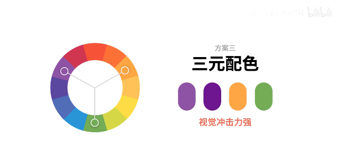
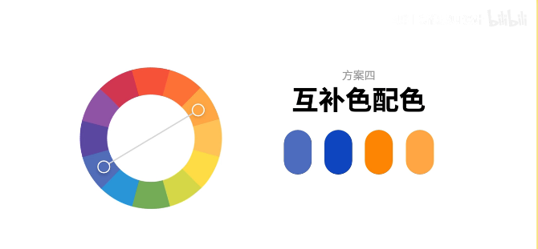
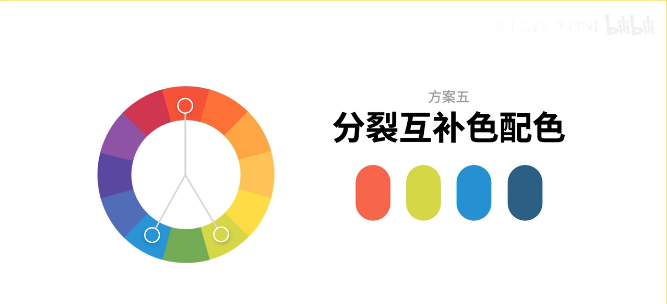
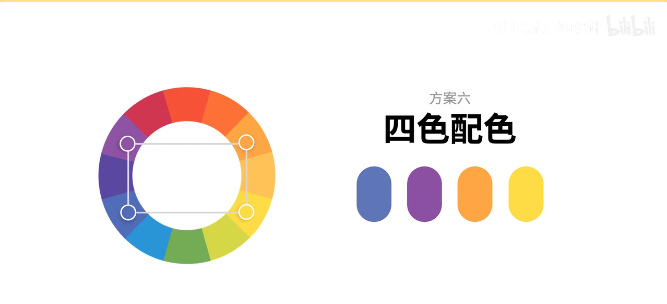

## 色彩基础理论知识

[TOC]

#### 色相

> 色相就是指不同的颜色。

  

#### 饱和度

> 饱和度就是指纯度，饱和度越高，颜色越鲜艳

  

#### 明度

> 明度是指色彩的明暗程度，明度越低色彩看起来越暗。

  

## 配色方案：

#### 方案一：单色配色

  

> 在色轮上选中一个颜色，通过明度划分成的一组颜色。这种方案不容易出错，比较稳定统一。

     

 ⬅️#f65238
     

 ⬅️#f99988
    

 ⬅️#fecbc4
    

 ⬅️#ffedeb

#### 方案二：邻近色配色

  

> 在色轮上选择几个彼此临近的颜色。整体效果协调有层次。

     

 ⬅️#516db8
     

 ⬅️#2795d9
    

 ⬅️#74ac56
    

 ⬅️#bbd6ab

#### 方案三：三元配色

  

> 在色轮上等距120度，均匀分布的颜色搭配组合，视觉冲击力强，要注意主色、辅助色的配比。

     

 ⬅️#8f53a5
     

 ⬅️#6e1590
    

 ⬅️#ffa644
    

 ⬅️#74ac56

#### 方案四：互补色配色

  

> 色轮上相对的两种颜色被称为补色，可以调节饱和度明度，增加色彩层次，这种方案视觉效果突出，对比强烈。

     

 ⬅️#4d6cbe
     

 ⬅️#0e45bf
    

 ⬅️#fd8503
    

 ⬅️#ffa644

#### 方案五：分裂互补色配色

  

> 在色轮上选择一种颜色，找到其互补色两侧的邻近色组成搭配方案，同样具有很强的诗句冲击力。

     

 ⬅️#f7654b
     

 ⬅️#d5d747
    

 ⬅️#2591d3
    

 ⬅️#2b6084

#### 方案六：四色配色

  

> 在色轮上选择两组互补色，把所选的颜色连接起来就形成了一个矩形，这种方案颜色冷暖明显，画面感丰富。

     

 ⬅️#5e76b7
     

 ⬅️#8c50a2
    

 ⬅️#ffa644
    

 ⬅️#fedc45

**转载自b站视频：[色彩基础理论及配色方法，让你的配色不再随缘-新像素_哔哩哔哩_bilibili](https://www.bilibili.com/video/BV15h411x7XP/?spm_id_from=pageDriver&vd_source=4665cf23fe42215fa0372cba4694e9f8)**